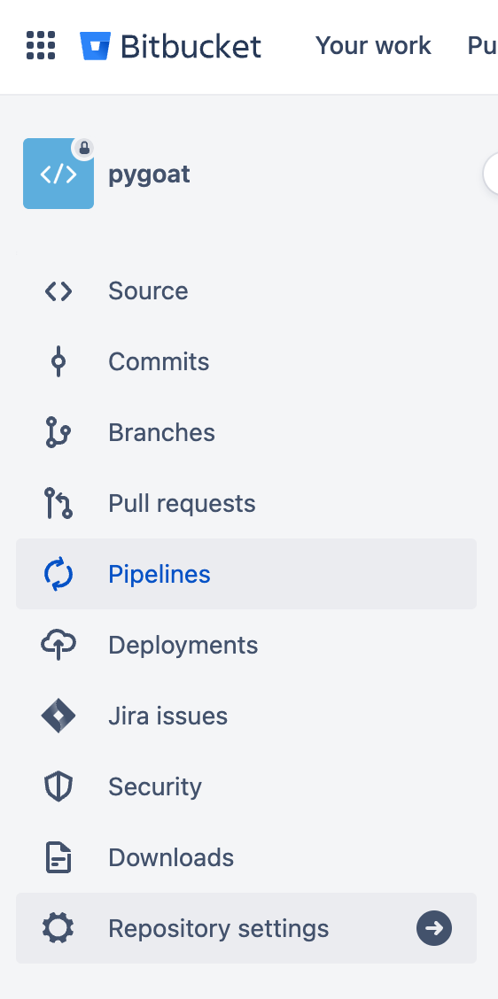
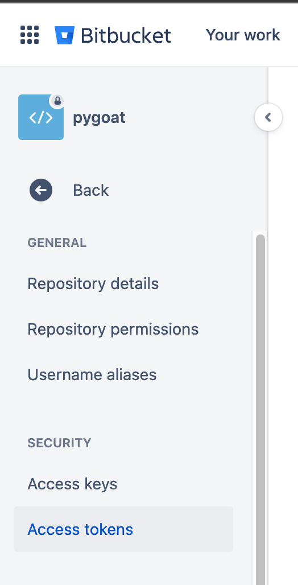
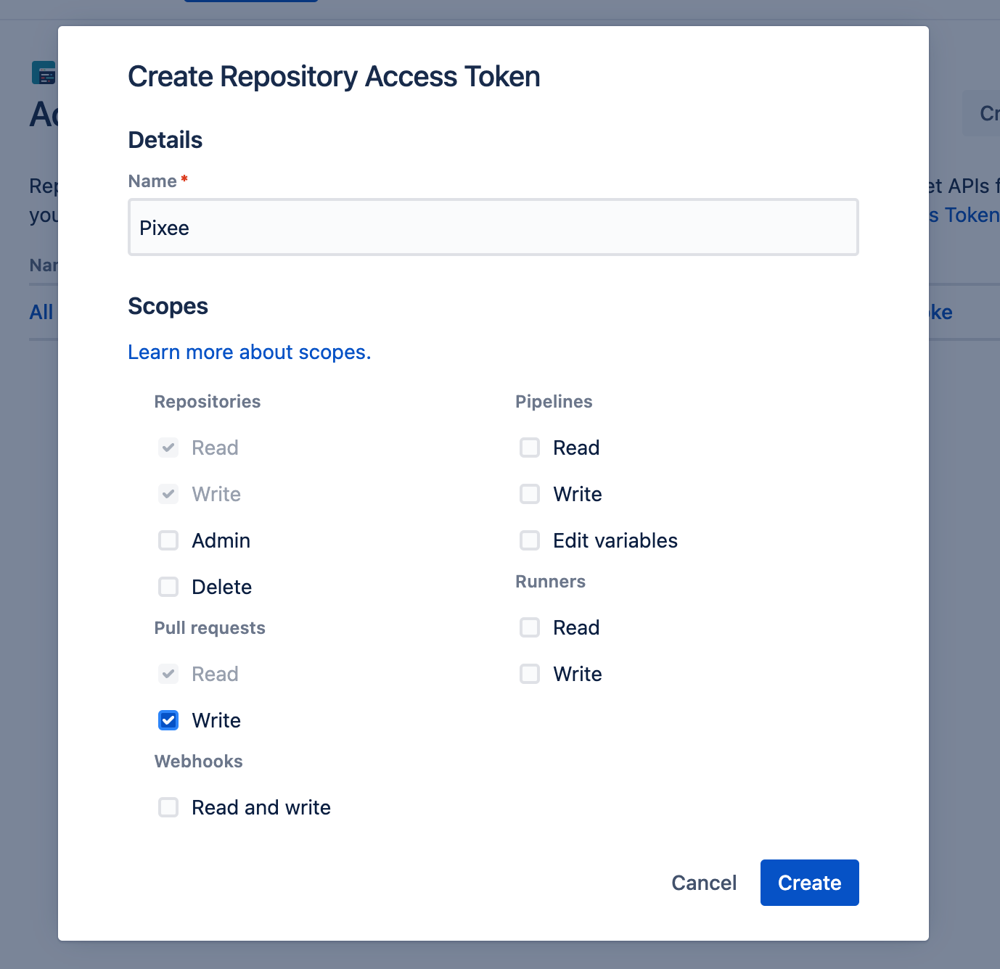
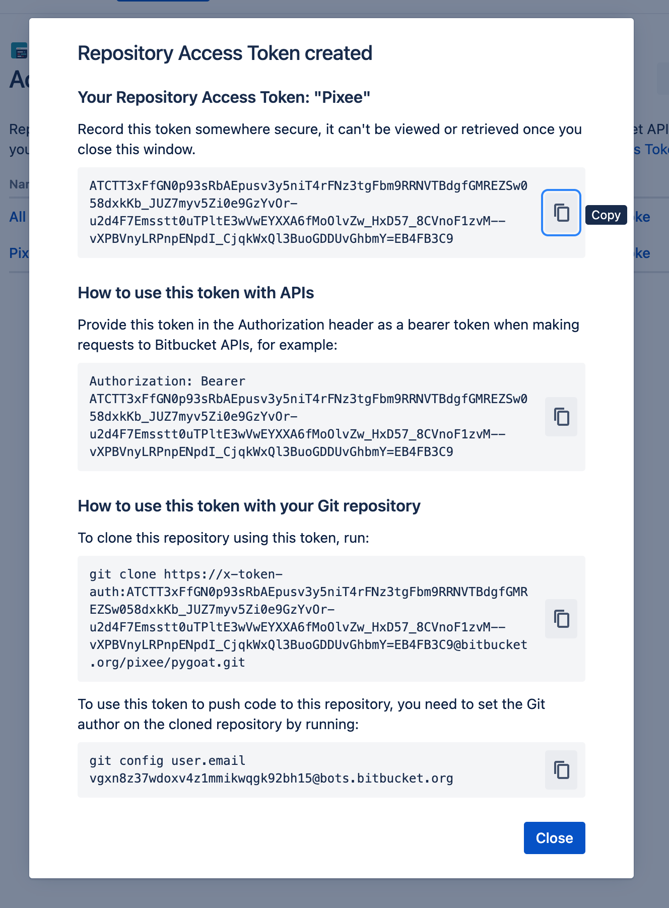
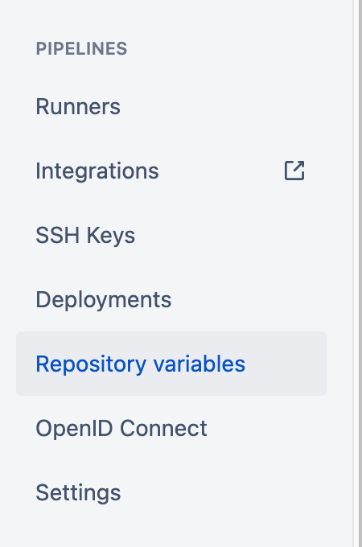
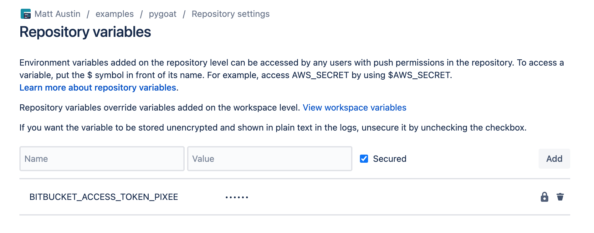

# Install the Bitbucket Pipeline

## Create a “Repository Access Token” for Pixee

1. Open your repo in Bitbucket and click on “Repository Settings” from the left navigation. 



2. Under “Security” click on “Access Tokens” 




3. Click on the “Create Repository Access Token” 
4. Give the token a name (Pixee for example) and check the box for under “Pull request” for “write” access. This will add all the other necessary scopes automatically. 



5. This will give you a key that you can copy for the next step. 



## Add the “Repository variables”

1. Click on “Repository variables” 



2. Add a new one with the name “BITBUCKET_ACCESS_TOKEN_PIXEE” and the value from the step above. 



## Add the pipeline: 

1. Under “Pipelines” Click settings and make sure pipelines are enabled for the branch. 
2. Add the following bitbucket-pipelines.yml file to your project. 

```YAML
image: atlassian/default-image:3

pipelines:
  pull-requests:
    '**': # This will run for pull requests targeting any branch
      - step:
          name: "Pixee PR"
          script:
            - echo "Pixee PR run" 
            - |
              if [[ ${#BITBUCKET_PR_DESTINATION_BRANCH} > 0 ]] && [[ $BITBUCKET_PR_DESTINATION_BRANCH != 'main' ]]; then
                echo "This is not a PR on main so we're exiting." && exit 0;
              fi
            - pipe: docker://codemodder/pixee-ci-bitbucket
```
