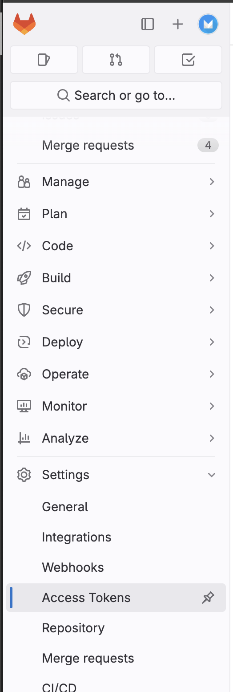
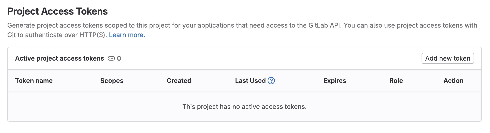
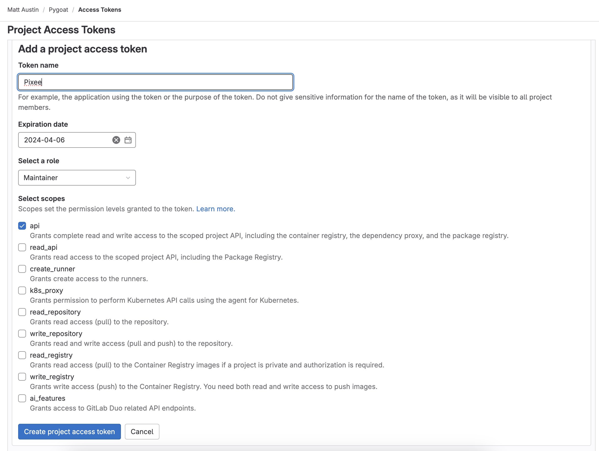
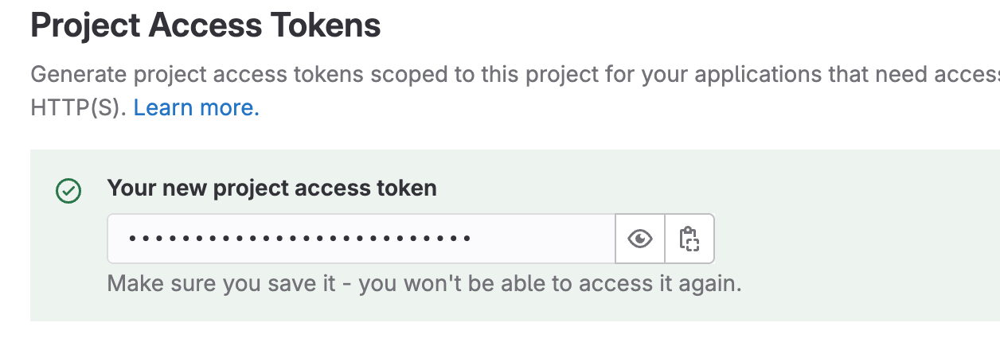
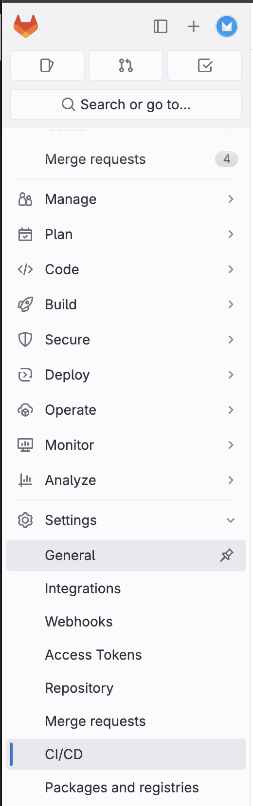
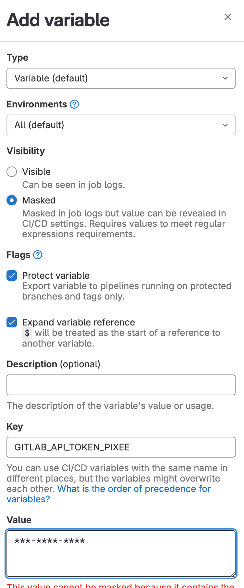

# Install the Gitlab Pipeline

## Create a “Repository Access Token” for Pixee

1. Open your repo in Gitlab and click on `Settings` -> `Access Token`. 



2. Click the `Add New Token` button 



3. Give the token a name like `Pixee` and select the API scope.



4. Copy the token for the next step> 



## Create a “Repository Access Token” for Pixee

1. Open your repo in Gitlab and click on `Settings` -> `CI/CD`.



2. Expand `Variables` -> `add variable` and create a new one with the key `GITLAB_API_TOKEN_PIXEE` and the value from the step above.



## Add the `Pixee` step to your pipeline

``` YAML
pixee:
  image: codemodder/pixee-ci-gitlab:0.0.4
  script: 
    - /pixee/gitlab/ci.sh

  artifacts:
    paths:
      - results.codetf.json
  rules:
    # pipeline should run on merge request to release branch
    - if: $CI_PIPELINE_SOURCE == 'merge_request_event' && $CI_MERGE_REQUEST_TARGET_BRANCH_NAME == $CI_DEFAULT_BRANCH
      when: always
    - when: never
```
